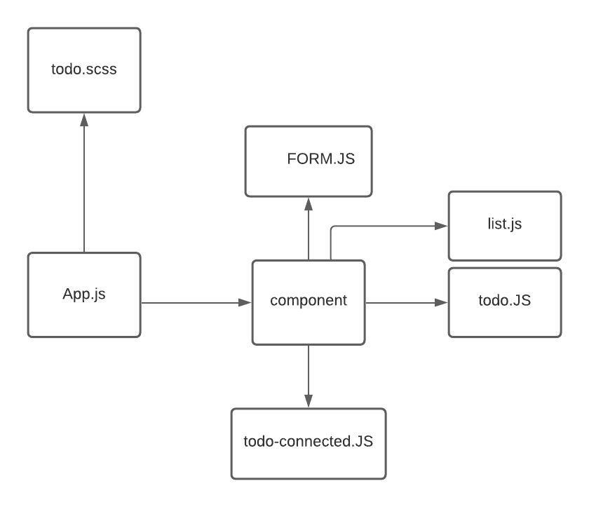

# TODO 

### Phase 1 
#### To Do List Manager Phase 1: Begin the build of an application designed for creating and organizing a “To Do” list in your browser.

## Phase 1 Requirements

- #### as a user, I would like an easy way to add a new to do item using an online interface
- #### As a user, I would like my to do items to have an assignee, due date, difficulty meter, status and the task itself
- #### As a user, I would like to delete to do items that are no longer needed
- #### As a user, I would like to easily mark to do items as completed
- #### As a user, I would like to edit an existing to do item

### UML
;